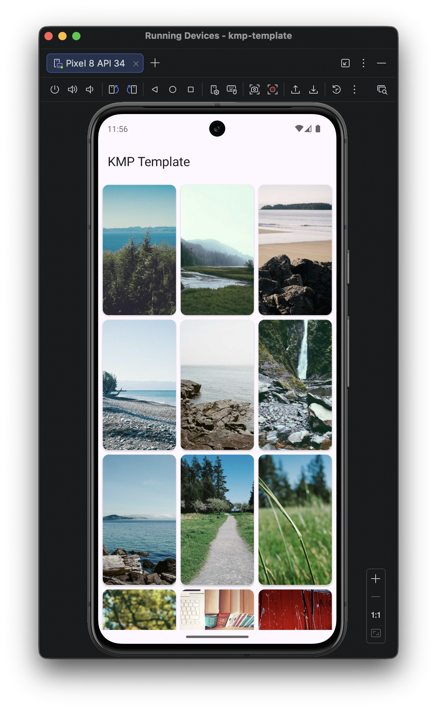
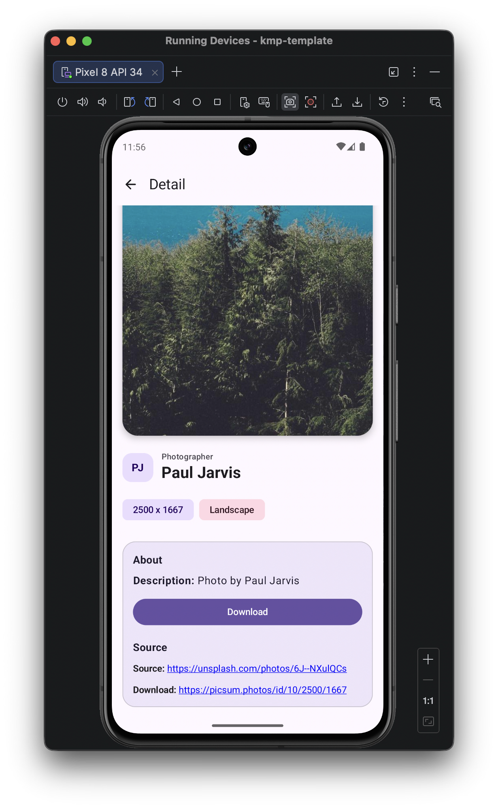

# KMP Template

This template repository provides a quick start for creating new Kotlin Multiplatform apps using
[Compose Multiplatform](https://www.jetbrains.com/compose-multiplatform/) as the UI framework and
targeting Android and iOS from a shared codebase.

It includes the following popular libraries:

- [Ktor](https://ktor.io/) - A multiplatform HTTP client for networking.
- [Metro](https://github.com/ZacSweers/metro) - A multiplatform, compile-time dependency injection
  framework for Kotlin.
- [Navigation3](https://developer.android.com/jetpack/androidx/releases/navigation3) - Multiplatform
  navigation APIs used for the app flow.
- [Room](https://developer.android.com/training/data-storage/room) - Cross-platform local
  persistence for Android and iOS with a shared schema setup.
- [AndroidX DataStore](https://developer.android.com/topic/libraries/architecture/datastore) -
  Key-value persistence for lightweight app preferences.
- [AndroidX Paging](https://developer.android.com/topic/libraries/architecture/paging/v3-overview) -
  Infinite scrolling support for paged image feeds.
- [Coil](https://github.com/coil-kt/coil) - Image loading in Compose Multiplatform.
- [Ktlint](https://pinterest.github.io/ktlint/) - Kotlin code style checks and formatting.

## How to use

To use this template, simply click on the **Use this template** button at the top (or fork the
repository) and start building your app on top of it.
Make sure to update the package name, app identifiers, and other app-specific details before
building and deploying your app.

## Visuals

### Android

<table>
  <tr>
    <th>Home Screen</th>
    <th>Detail Screen</th>
  </tr>
  <tr>
    <td></td>
    <td></td>
  </tr>
</table>

### iOS

<table>
  <tr>
    <th>Home Screen</th>
    <th>Detail Screen</th>
  </tr>
  <tr>
    <td></td>
    <td></td>
  </tr>
</table>

## Project structure

- [/composeApp](./composeApp/src) is for shared and platform-specific Kotlin code:
    - [commonMain](./composeApp/src/commonMain/kotlin) contains shared logic, UI, and app
      architecture.
    - [androidMain](./composeApp/src/androidMain/kotlin) contains Android-only implementations.
    - [iosMain](./composeApp/src/iosMain/kotlin) contains iOS-only implementations.
- [/iosApp](./iosApp/iosApp) contains the iOS entry application and SwiftUI integration layer.

## CI/CD

This project includes built-in support for [GitHub Actions](https://github.com/features/actions) to
automate builds, run tests, and ensure code quality.
CI/CD workflows can be found in the `.github/workflows/` directory and can be customized based on
your needs.

## Unit Testing

This project supports multiplatform testing with the following features:

- Common Kotlin tests in `commonTest` (for example, utility and PagingSource behavior tests).
- Android host test execution via Gradle (`./gradlew :composeApp:testDebugUnitTest`).
- iOS simulator test execution via Gradle (`./gradlew :composeApp:iosSimulatorArm64Test`) for shared
  `commonTest` coverage.
- Platform-specific source sets like `androidUnitTest` and `iosTest` can be added as needed when
  target-specific test cases grow.

## Formatting

This project uses [Ktlint](https://pinterest.github.io/ktlint/) for Kotlin code style and
formatting.

To format Kotlin code locally, run:

```shell
./gradlew ktlintSourceFormat
```

To check formatting without changing files, run:

```shell
./gradlew ktlintSourceCheck
```

## Build and Configuration Caching

This project also takes advantage of
Gradle's [Build Cache](https://docs.gradle.org/current/userguide/build_cache.html)
and [Configuration Cache](https://docs.gradle.org/current/userguide/configuration_cache.html)
features to speed up builds and reduce build times.
Note that these features may not always provide significant improvements in build times depending on
the project structure and build complexity.

## Build and Run Android Application

To build and run the development version of the Android app, use the run configuration from the run
widget
in your IDE’s toolbar or build it directly from the terminal:

- on macOS/Linux
  ```shell
  ./gradlew :composeApp:assembleDebug
  ```
- on Windows
  ```shell
  .\gradlew.bat :composeApp:assembleDebug
  ```

## Build and Run iOS Application

To build and run the development version of the iOS app, use the run configuration from the run
widget
in your IDE’s toolbar or open the [/iosApp](./iosApp) directory in Xcode and run it from there.

## Contribution

Contributions to this project are welcome! If you encounter any problems or have suggestions for
improvement, feel free to submit a pull request or open an issue.

## License

This project is licensed under
the [MIT License](https://github.com/hadiyarajesh/compose-template/blob/master/LICENSE).
